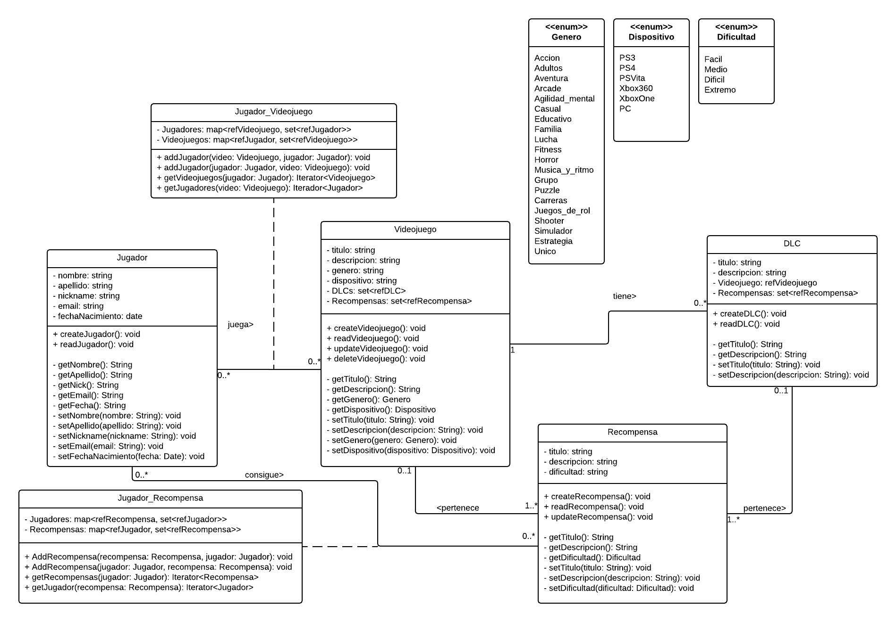
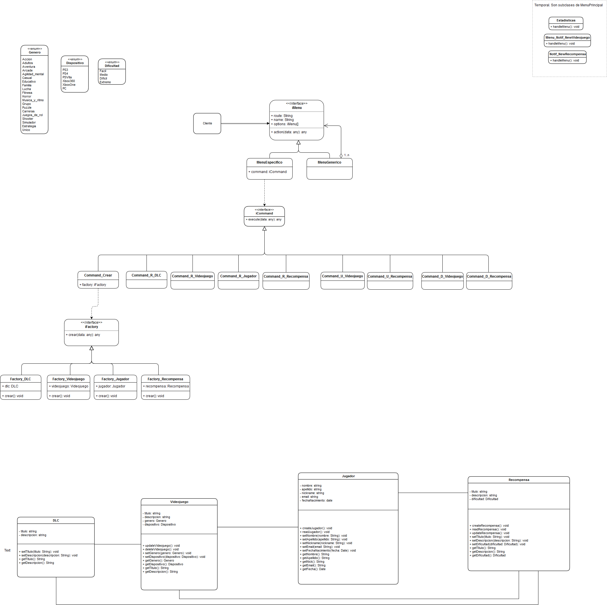

# DSS/IISS - Sistema de Recompensas

Desarrollado por **Alejandro Romero Navarrete** y **Pablo de los Ríos Gestoso**.

## Diagramas de Clases (UML)

### Diseño preliminar
​	

### Diseño con patrones (incompleto)
​	

#### Fallos/Dudas en el diseño

- Los menus usan la interfaz `Factory` (crearte, update, delete) pero no todos usan todas las opciones. ¿A lo mejor dividir en varias interfaces? ¿Adapter puede?
- ¿Relacionar DLC/Videojuego  con Recompensas?
- ¿Listas en las clases de asociación?
- ¿Quien se encarga de hacer los Read()? (De momento solo hay interfaces con getters)
- Opciones para estadísticas sin asociar.

## Patrones de Diseño Aplicados

### Comportamiento

#### Handler 

Hemos usado este patrón para diseñar la interfaz del menú.

El cliente tiene acceso únicamente a la interfaz `MenuHandler` la cual por defecto delegará la responsabilidad al menú principal. Este muestra su menú y en función de la opción seleccionada por el usuario, delegará al siguiente submenú hasta llegar a una función concreta, donde se delegará finalmente a las clases responsables de efectuar la operación.

De esta manera podremos añadir o borrar opciones disponibles en el menú sin afectar la interfaz final del usuario ni el resto de opciones (**OCP**). Además, le dejamos con la única responsabilidad de mostrar el menú, mientras que el resto de funcionalidad queda redirigido a las clases correspondiente (**SRP**).

### Iterator

El patrón iterator nos permite hacer uso de del listado de DLCs, recompensas, jugadores y videojuegos mediante una única interfaz abstraída de la implementación.  Así nos es indiferente que tipo de objeto estemos almacenando, y podremos cambiar la estructura del listado sin afectar a las clases que hagan uso de él.

### Creacional

#### Factory

Al usar el patrón *Factory*, le estamos quitando tanto a las clases como al menú la responsabilidad de la creación (borrado y actualización) de los objetos. Con esto conseguimos que las clases (DLC, Videojuego, Jugador y Recompensa) se encarguen de guardar su propia información, dejando el resto de responsabilidades a clases externas. Del mismo modo, el menú no se preocupa por la creación y simplemente trabaja con las clases mediante interfaces.

