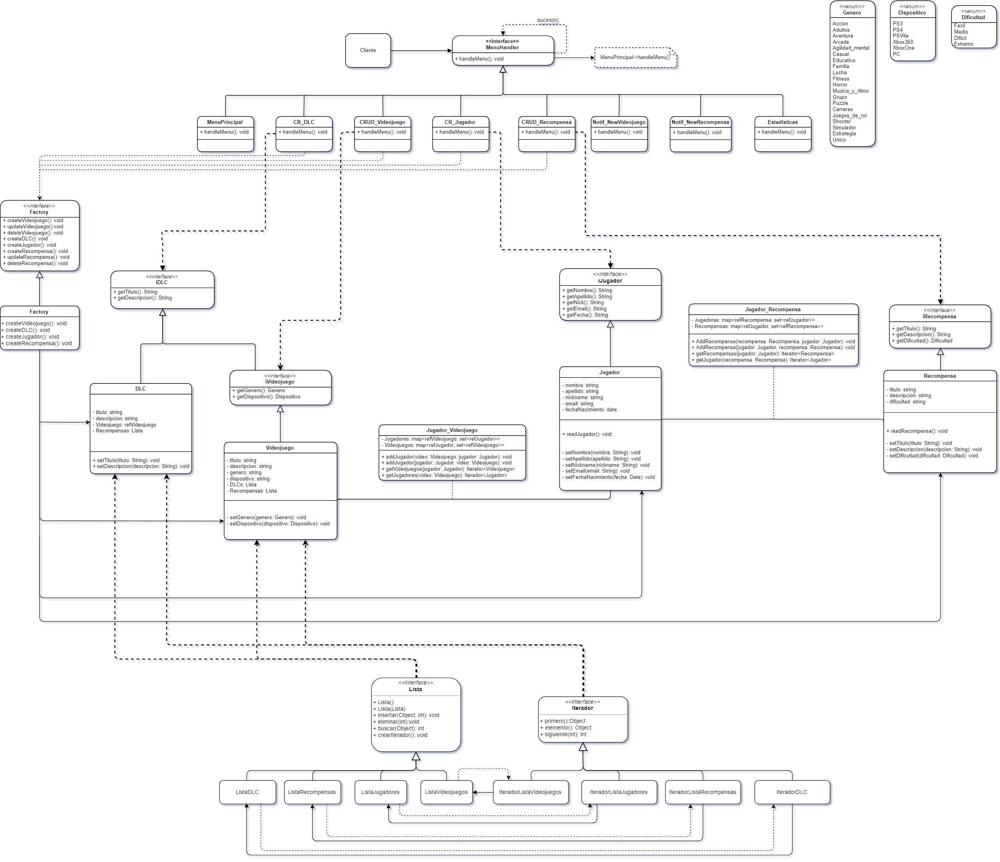

# DSS/IISS - Sistema de Recompensas

Desarrollado por **Alejandro Romero Navarrete** y **Pablo de los Ríos Gestoso**.

## Explicación General del Sistema

​	[···]

## Reparto de Tareas

​	[···]

## Diagramas de Clases (UML)

### Diseño preliminar
​	

### Diseño con patrones
​	

## Patrones de Diseño Aplicados

​	[···]

## Justificaciones de Diseño

​	[···]

## Ejemplos de Casos de Uso

​	[...]

