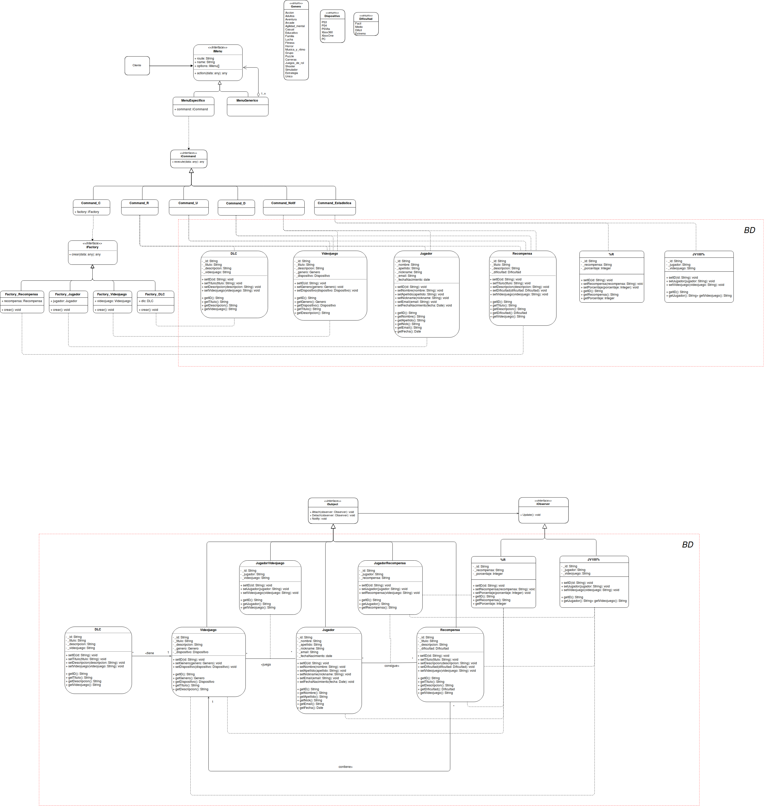

# DSS/IISS - Sistema de Recompensas

Desarrollado por **Alejandro Romero Navarrete** y **Pablo de los Ríos Gestoso**.

## Diagramas de Clases (UML)

### Diseño preliminar
​	

### Diseño con patrones
​	

## Patrones de Diseño Aplicados

### Estructural

#### Composite 

Hemos usado este patrón para diseñar la interfaz del menú.

El cliente tiene acceso únicamente a la interfaz `iMenu`, la cual se implementa en un `MenuGenerico` o un `MenuEspecifico`. Un menu generico no realiza nada en `action()` salvo mostrar todas sus opciones `getOptions()`, las cuales son otras interfaces `iMenu`. Por otro lado un `MenuEspecifico` sirve como padre *(para evitar duplicidad de codigo)* para el resto de menus finales, los cuales no tienen mas opciones pero realizan una accion final

De esta manera podremos añadir o borrar opciones disponibles en el menú sin afectar la interfaz final del usuario ni el resto de opciones (**OCP**) y el trato de un menu se puede hacer de manera uniforme sin importar el tipo de menu que sea.

Cabe destacar que nos encontramos con el incoveniente de que los menus finales nunca harán uso de `getOptions()` al igual que un menu genérico tampoco usará `action()`. Esto es un precio a pagar por la uniformidad del menú a la que primamos importancia. 

### Creacional

#### Factory method

Al usar el patrón *Factory Method*, le estamos quitando tanto a las clases como al menú la responsabilidad de la creación de los objetos. Con esto conseguimos que las clases (DLC, Videojuego, Jugador y Recompensa) se encarguen de guardar su propia información, dejando el resto de responsabilidades a clases externas. Del mismo modo, el menú no se preocupa por la creación y simplemente trabaja con las clases mediante interfaces. (**SRP**)

### Comportamiento

### Command

Tenemos una interfaz `iCommand` con un único método `execute()` este método se implementa en los diferentes commands concretos. Estos se crearán dentro de cada menu final, con el objetivo de que el menu solo se preocupe de lanzar un commando generico y este sepa que debe hacer. Puede que simplemente delegue la funcionalidad a otra clase *(como es el caso de delegar la creacion a la factoria)*, o puede que contenga algo de logica como leer los datos de un elemento.

El objetivo final es el de desacoplar la clase que pide una accion de aquella que realmente la realiza. Todo mediante una interfaz génerica.

Nos crea el inconveniente de muchas clases extras y puede dificultar la legibilidad del codigo, pero si mantenemos la lógica de los comandos simples, no es mas que un paso intermedio entre dos clases.
